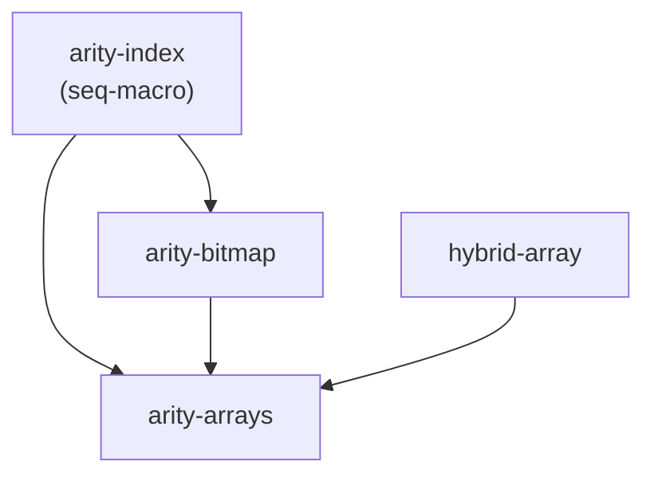

# Arity Arrays — Design

> Status: proposed · 2026-06-26
>
> Three small, `no_std` crates for fixed-arity array storage indexed by
> bounds-check-free niche integers, with a compact heap-packed sparse
> representation. Generalizes the `DenseChildren` / `Children` / `U4` work from
> [`ava-labs/firewood#2100`](https://github.com/ava-labs/firewood/pull/2100) from
> a single 16-wide trie-children layout to arbitrary power-of-two arities from 8
> to 256.
>
> **Scaffolding is in place.** The workspace is already split into the three
> crates below — `arity-index`, `arity-bitmap`, and `arity-arrays` (the array
> crate is plural) — with stub `#![no_std]` `lib.rs` files, `seq-macro` wired into
> `arity-index`, the inter-crate dependencies declared, and the `unsafe` lints
> promoted to `deny`. `arity-arrays/src/lib.rs` re-exports the dependency crates
> as `arity_arrays::index` and `arity_arrays::bitmap`, so a consumer can reach the
> primitives through the top-level crate. Implementation fills in the modules
> described below; compile-time `seq-macro` codegen generates the niche `Repr`
> enums (see [Codegen](#the-niche-trick)).

## Motivation

A hexary (16-ary) trie stores each branch node's children in a fixed array indexed
by a 4-bit nibble. Two representations are useful:

- A **full-width** array — one slot per index, every slot materialized. Cheap
  random access, fixed size regardless of occupancy.
- A **packed** array — only present entries stored, addressed by a bitmap.
  Pointer-sized when empty; heap cost proportional to occupancy. This is the
  memory-amplification mitigation from firewood#2100: a 16-slot
  `Children<Option<HashType>>` costs ~528 bytes even when empty, while the packed
  form costs one pointer plus `bitmap + occupancy × size_of::<T>()`.

Both rely on a **niche integer index** — a 4-bit type whose value is statically
known to be in `0..16`, which (a) makes `Option<Index>` one byte via niche
optimization and (b) lets the compiler elide bounds checks when indexing.

This project generalizes all three pieces — the index, the bitmap, and the two
arrays — over a power-of-two **arity** `N ∈ {8, 16, 32, 64, 128, 256}`, each with
a matching niche index type and bitmap backing:

| Arity `N` | Index type | `Option<Index>` | Bitmap backing |
| --------: | ---------- | --------------- | -------------- |
|         8 | `U3`       | 1 byte          | `u8`           |
|        16 | `U4`       | 1 byte          | `u16`          |
|        32 | `U5`       | 1 byte          | `u32`          |
|        64 | `U6`       | 1 byte          | `u64`          |
|       128 | `U7`       | 1 byte          | `u128`         |
|       256 | `u8`       | 2 bytes¹        | `U256`         |

¹ Arity-256 uses the native `u8` as its index. `u8`'s maximum (255) is already
`< 256`, so indexing a 256-element array elides the bounds check without a custom
type; `Option<u8>` is 2 bytes, but no `Option<index>` is stored on a hot path, so
this costs nothing in practice.

## Goals and non-goals

**Goals**

- Three focused, `no_std` crates with a clean dependency DAG.
- One niche index type per arity, with `Option<U{n}>` provably one byte and
  bounds-check elision on indexing.
- `FixedArray<T, A>` (full-width) and `PackedArray<T, A>` (heap-packed), both
  generic over a single `Arity` trait.
- `PackedArray` is **pointer-sized** for every arity and zero-heap when empty.
- A strict `unsafe` quality bar: every `unsafe` block documented, Miri-clean, and
  property-tested.

**Non-goals (deferred — see [Future work](#future-work))**

- In-place mutation of `PackedArray` (`insert`/`remove`). It is
  immutable-after-construction; mutate by round-tripping through `FixedArray`.
  **Known cost:** the round trip materializes a full `FixedArray<Option<T>, A>` —
  `O(A::LEN × size_of::<Option<T>>())` of stack, independent of occupancy. At
  arity 256 with a 32-byte `T` that is a ~8 KiB stack temporary; for very large
  `T` or constrained stacks this can be significant. This is acceptable for the
  motivating use case (trie branch writes are infrequent and `T` is pointer- or
  hash-sized), but it is the reason a future in-place API is worth having.
- A general-purpose big-integer `U256` (arithmetic, formatting). Only the bitmap
  operations the arrays need are implemented.
- Serialization / wire formats. Out of scope for these crates.
- Non-power-of-two or runtime arities.

## Workspace layout

```
crates/
  arity-index/         # no_std, no alloc — integer index primitives
    src/lib.rs
    src/niche.rs       # `Niche` trait + macro generating U3..U7; `u8` impl
    src/range.rs       # NicheRange / NicheRangeInclusive double-ended iterators
  arity-bitmap/        # no_std, no alloc — bitmap primitives (depends on arity-index)
    src/lib.rs         # `Bitmap` trait + impls for u8/u16/u32/u64/u128
    src/u256.rs        # `U256([u128; 2])` bitmap backing (safe code)
    src/iter.rs        # `BitIter<B>` double-ended iterator over set bits
  arity-arrays/        # no_std + alloc — the arrays
    src/lib.rs         # re-exports `arity_index as index`, `arity_bitmap as bitmap`
    src/arity.rs       # `Arity` trait + markers Arity8..Arity256
    src/fixed.rs       # FixedArray<T, A>
    src/packed.rs      # PackedArray<T, A>
```

### Dependency DAG



`arity-index` is the sole leaf. `arity-bitmap` depends on it so the `Bitmap`
trait can speak in the typed index (`Niche`) rather than raw `usize` — which
makes every bit position statically `< WIDTH`, eliminating the shift-UB
precondition entirely. `arity-arrays` is the only crate that needs `alloc`, and
the only one with heavy `unsafe`. Splitting this way keeps the primitive types
reusable and lets their tests run without touching the allocator. `hybrid-array`
is a third-party crate (`RustCrypto/hybrid-array`) that bridges `typenum` and
const generics; `arity-arrays` depends on it solely to express `[T; A::LEN]`
storage on stable Rust (see the [`typenum` note](#the-arity-trait)).

## `arity-index`

### The niche trick

A niche index type is a newtype over a **fieldless enum with exactly `2ⁿ`
variants** — firewood's `U4`/`Repr` pattern, generalized:

```rust
// generated for n = 4 (illustrative)
#[derive(Clone, Copy, PartialEq, Eq, PartialOrd, Ord, Hash)]
enum Repr4 { V0, V1, /* … */ V15 }

#[derive(Clone, Copy, PartialEq, Eq, PartialOrd, Ord, Hash)]
pub struct U4(Repr4);
```

The enum gives the compiler a layout with `2ⁿ` valid discriminants and the rest
as **niches**, which earns both payoffs:

- `Option<U{n}>` reuses an unused discriminant for `None` → stays 1 byte.
- A value of type `U{n}` is statically known to be in `0..2ⁿ`, so indexing a
  `2ⁿ`-length array can elide the bounds check.

`U7` needs 128 variants — too many to hand-write — so the macro uses
[`seq-macro`](https://docs.rs/seq-macro) (stable) to generate `V0..V{2ⁿ-1}` and
the `0..2ⁿ` match arms. The single declarative macro is invoked five times
(`niche_int!(U3, Repr3, 3); … niche_int!(U7, Repr7, 7);`).

Compile-time expansion keeps a single source of truth (no committed generated
`.rs` to drift), at the cost of one build dependency (`seq-macro`) and generated
code that is visible only via `cargo expand`. Both the inner `Repr` enum and the
outer `U{n}` struct derive `Default` (`#[default]` on variant 0, so
`U{n}::default() == U{n}::MIN`).

### Generated surface (per `U{n}`)

```rust
impl U{n} {
    pub const BITS: u32 = n;
    pub const COUNT: usize = 1 << n;       // number of valid values
    pub const MIN: Self;                    // 0
    pub const MAX: Self;                    // COUNT - 1

    pub const fn try_new(v: u8) -> Option<Self>;
    pub const unsafe fn new_unchecked(v: u8) -> Self;  // SAFETY: v < COUNT
    pub const fn new_masked(v: u8) -> Self;            // keeps low n bits
    pub const fn as_u8(self) -> u8;
    pub const fn as_usize(self) -> usize;
}
// derives: Clone, Copy, PartialEq, Eq, PartialOrd, Ord, Hash, Default (== MIN)
// impls:   Debug, Display, LowerHex, UpperHex, Binary, TryFrom<u8>
```

`new_unchecked` is the sole `unsafe` entry point; `new_masked` calls it after
masking, so it is always sound. There is **no `ALL` constant** — iteration is via
the range iterators below, so nothing has to materialize a `2ⁿ`-element table
(an `[U7; 128]`/`[u8; 256]` const would otherwise sit in the binary).

### Range iterators (`NicheRange`, `NicheRangeInclusive`)

The std `Range<T>`/`RangeInclusive<T>` cannot iterate over a `U{n}`: that needs
`impl Step for U{n}`, and `Step` is unstable on stable Rust. So `arity-index`
ships two custom, generic, **double-ended** range iterators (replacing the `ALL`
table as the canonical iteration order):

```rust
pub struct NicheRange<N: Niche>          { lo: usize, hi: usize, _marker: PhantomData<N> } // [lo, hi)
pub struct NicheRangeInclusive<N: Niche> { lo: usize, hi: usize, done: bool, _marker: … }  // [lo, hi]

impl<N: Niche> Iterator for NicheRange<N> { type Item = N; /* … */ }
// + DoubleEndedIterator + ExactSizeIterator + FusedIterator for both
```

They store the bounds as `usize` (so the inclusive form can represent an empty
range and avoid `MAX + 1` overflow) and reconstruct each `N` at yield time via
`N::try_from_usize(i).unwrap_unchecked()` — sound because the cursor is always
within `[0, COUNT)` by construction. This is *the* single place an index is
reconstructed from a raw integer; concentrating it here keeps `new_unchecked` off
the `Niche` trait (see below). `next`/`next_back` advance `lo`/`hi` from opposite
ends, giving exact-size double-ended iteration for free — which `FixedArray` and
`PackedArray` inherit. The two `len` formulas differ because the bounds carry
different semantics: `NicheRange` (`[lo, hi)`) reports `hi - lo`, while
`NicheRangeInclusive` (`[lo, hi]`) reports `if done { 0 } else { hi - lo + 1 }`.
So `Niche::all()` (= `0..=COUNT-1`) has `len() == COUNT`, exactly matching the
domain size.

### The `Niche` trait

A **sealed** trait unifies the index types so `arity-arrays` can be generic:

```rust
pub trait Niche: Copy + Ord + Sized + sealed::Sealed {
    const COUNT: usize;                       // 2^BITS (8,16,32,64,128,256)
    fn as_usize(self) -> usize;               // always < COUNT
    fn try_from_usize(i: usize) -> Option<Self>;

    /// All values ascending, as a double-ended exact-size iterator (`MIN..=MAX`).
    /// Replaces the old `ALL` table.
    fn all() -> NicheRangeInclusive<Self> { /* provided: indices 0..=COUNT-1 */ }
}
```

`all()` is a provided method built from `COUNT`, so every implementor gets
double-ended iteration over its whole domain with no per-type table. The trait
deliberately has **no `new_unchecked`**: the only `unsafe` reconstruction lives in
the range iterators, keeping `new_unchecked` an *inherent* method on the concrete
types (and sidestepping a parameter-type mismatch — the inherent constructor
takes `u8`, the trait works in `usize`).

Implemented for `U3..U7` (generated) and for **`u8`** (`COUNT = 256`,
`try_from_usize` is `(i < 256).then(|| i as u8)`). `u8` is the arity-256 index.

`arity-index` is `#![no_std]` and does **not** use `alloc`.

## `arity-bitmap`

### The `Bitmap` trait

A **sealed** trait over the bitmap backings, parameterized by its index type so
that **every bit position is the statically-bounded `Niche`**, never a raw
`usize`. This is why `arity-bitmap` depends on `arity-index`:

```rust
pub trait Bitmap: Copy + Eq + sealed::Sealed {
    type Index: Niche;                        // U3..U7 or u8 — WIDTH == Index::COUNT
    const WIDTH: usize;                       // bit count: 8,16,32,64,128,256
    const ZERO: Self;
    fn is_zero(self) -> bool;
    fn count_ones(self) -> u32;               // number of present slots
    fn test(self, i: Self::Index) -> bool;    // is bit i set?
    fn with_bit(self, i: Self::Index) -> Self; // set bit i
    fn rank(self, i: Self::Index) -> u32;     // # set bits strictly below i
    fn bits(self) -> BitIter<Self>;           // double-ended iter over set bits
}
```

Because the index is `Self::Index` (always `< WIDTH` by construction), the
`1 << i` shift inside `test`/`with_bit`/`rank` can never reach the type width —
**the shift-UB precondition that a raw-`usize` API would carry simply does not
exist.** `rank(i)` is the dense offset of slot `i` within a `PackedArray`
allocation; `with_bit` builds a bitmap when converting a `FixedArray` into a
`PackedArray`.

`trailing_zeros`/`clear_lowest` are no longer public trait methods — they are
internal details of `BitIter`. **`BitIter<B: Bitmap>`** (in `iter.rs`) takes a
**copy** of the bitmap and yields the set bits as `B::Index`:

```rust
pub struct BitIter<B: Bitmap> { remaining: B }   // Copy snapshot, drained as it iterates

impl<B: Bitmap> Iterator for BitIter<B> {
    type Item = B::Index;
    fn next(&mut self) -> Option<B::Index> { /* lowest set bit: trailing_zeros → clear it */ }
}
// next_back uses the highest set bit (leading-zeros); + ExactSizeIterator
// (len == remaining.count_ones()) + FusedIterator
```

Front iteration clears the lowest set bit, back iteration clears the highest, and
`len` is `count_ones()` — so it is double-ended and exact-size. Yielded indices
are reconstructed through `B::Index::try_from_usize(..).unwrap_unchecked()`
(positions come from `trailing_zeros`/bit-width math and are provably valid).
`PackedArray`'s present-iterator is built directly on `bits()`.

Implemented for `u8, u16, u32, u64, u128` (thin wrappers over the standard
methods) and for `U256`.

### `U256`

```rust
pub struct U256 { lo: u128, hi: u128 }   // bit i: i<128 → lo bit i, else hi bit i-128
```

Pure **safe** code. Bit `i` lives in `lo` for `i < 128` and `hi` otherwise;
`count_ones`/`rank` and the internal `trailing_zeros`/leading-zeros used by
`BitIter` combine the two limbs (e.g.
`trailing_zeros = if lo != 0 { lo.trailing_zeros() } else { 128 + hi.trailing_zeros() }`).
`U256::Index = u8` (`WIDTH = 256`). Only the `Bitmap` surface is implemented — no
`Add`/`Mul`/`From`/`Display`.

`arity-bitmap` is `#![no_std]` and does **not** use `alloc`. It depends on
`arity-index` for the `Niche` index types (`Bitmap::Index`, `BitIter`'s item).

## `arity-arrays`

### The `Arity` trait

The single "trait interface" both arrays are generic over. Sealed; one marker
type per arity:

```rust
pub trait Arity: sealed::Sealed {
    const LEN: usize;                                  // 8,16,32,64,128,256
    type Index: Niche;                                 // U3..U7 or u8
    type Bitmap: Bitmap<Index = Self::Index>;          // u8..u128 or U256
    type Size: hybrid_array::ArraySize;                // typenum U8..U256, backs FixedArray
}

pub enum Arity8 {} pub enum Arity16 {} /* … */ pub enum Arity256 {}
```

Each marker wires index ↔ bitmap ↔ size together (e.g. `Arity16`: `LEN = 16`,
`Index = U4`, `Bitmap = u16`, `Size = typenum::U16`). The
`Bitmap<Index = Self::Index>` bound makes the index/bitmap pairing a
**compile-time guarantee**, not just a convention. Invariants the wiring
guarantees and tests assert:
`Index::COUNT == LEN == Bitmap::WIDTH == Size::USIZE`.

> [!NOTE]
> **`typenum` is an acknowledged sunset dependency.** `type Size: ArraySize`
> exists only because stable Rust cannot write `[T; A::LEN]` with `LEN` a trait
> associated `const` (`generic_const_exprs` is unstable). `hybrid-array` /
> `typenum` is the right tool today, but `Arity::Size` and `ArraySize` leak into
> downstream `where` bounds. To contain the blast radius, **`hybrid_array::Array`
> never appears in a public function signature** — `FixedArray` exposes
> `Deref<Target = [T]>` / `AsRef<[T]>` instead. When `generic_const_exprs`
> stabilizes, the internal storage can switch to `[T; A::LEN]`; keeping `Array`
> out of the public surface is what makes that a non-breaking change.

### `FixedArray<T, A: Arity>`

Full-width inline storage — one `T` per slot — over `hybrid_array::Array<T, A::Size>`:

```rust
pub struct FixedArray<T, A: Arity>(hybrid_array::Array<T, A::Size>);
```

Indexed by `A::Index`. `get`/`get_mut` use `slice::get_unchecked(index.as_usize())`:

```rust
// SAFETY: `A::Index::as_usize()` is always < Index::COUNT == A::LEN, which equals
// the array length, so the index is in bounds.
unsafe { self.0.get_unchecked(index.as_usize()) }
```

This is the documented "no bounds check" path. Ported surface (from firewood's
`Children`): `from_fn`, `each_ref`/`each_mut`, `get`/`get_mut`/`replace`, `map`,
`merge`, `Index`/`IndexMut`, and `IntoIterator` (zipping `A::Index::all()` with the
elements). Because `all()` is double-ended and exact-size, `FixedArray`'s
iterators are `DoubleEndedIterator + ExactSizeIterator`. The
`FixedArray<Option<T>, A>` specialization adds `new`, `count`, `take`,
`iter_present`, and `take_only_child`.

### `PackedArray<T, A: Arity>`

The pointer-sized heap-packed representation — firewood's `DenseChildren`,
generalized over `A`:

```rust
pub struct PackedArray<T, A: Arity>(Option<NonNull<Inner<A, T>>>, PhantomData<Box<T>>);

#[repr(C)]
struct Inner<A: Arity, T> {
    bitmap: A::Bitmap,
    data: [T; 0],   // address anchor; element base via &raw mut (*p).data (RFC 2582)
}
```

Layout & invariants:

- `None` ↔ empty, **zero heap**. The `NonNull` null-pointer niche makes
  `PackedArray<T, A>` **pointer-sized** for every `A`.
- `Some(p)` ↔ a heap block: `Inner` header + `bitmap.count_ones()` elements,
  stored in ascending slot order. **Invariant: when allocated, `bitmap != 0`.**
  This is documented rather than encoded with `NonZero`. firewood's
  `DenseChildren` used `NonZeroU16` for a *static* non-zero guarantee; this
  static non-zero guarantee is dropped **for every arity** (8–128 have `NonZeroU8..U128`
  counterparts, but `U256` does not) to keep `A::Bitmap` and the `Inner` layout
  uniform across all arities. The pointer-niche that makes the type pointer-sized
  is on the outer `NonNull`, not the bitmap, so nothing about the size guarantee
  depends on the bitmap being `NonZero`.
- The allocation layout is `Layout::new::<Inner>().extend(Layout::array::<T>(count))`
  padded to alignment — identical to firewood's `alloc_layout`.

Behavior (ported and generalized):

- `new`/`Default` (empty), `bitmap`, `count`, `get` (via `Bitmap::rank`).
  - `iter_present` (`(A::Index, &T)`) is built directly on `bitmap.bits()`: for
    each yielded index `i`, the element is at `data.add(bitmap.rank(i))`. The
    `rank` call uses the **original, unmodified bitmap snapshot** captured at
    iterator construction — *not* `BitIter`'s progressively-drained `remaining`
    copy — so the dense offset for slot `i` is correct regardless of iteration
    direction or how many elements have already been yielded. It inherits
    `bits()`'s **`DoubleEndedIterator + ExactSizeIterator + FusedIterator`** — no
    manual pointer-advance or slot counter, so the previous `u8`-slot-counter
    overflow concern (slot 255 at arity 256) disappears.
  - all-slots `iter` (`(A::Index, Option<&T>)`) maps `A::Index::all()` over
    `self.get(i)`, so it too is `DoubleEndedIterator + ExactSizeIterator + FusedIterator`
    and spans `0..LEN` correctly for every arity.
- `Drop`: read count from the bitmap, then one `ptr::drop_in_place` over a slice
  pointer covering all elements, then `dealloc`.
- `Clone`: allocate, copy the bitmap, clone elements under a `CloneGuard` drop
  guard that frees partially-cloned elements (and the allocation) if `T::clone`
  panics.
- `PartialEq`/`Eq`/`Hash` (bitmap then element slice), `Debug` (map of present
  slots), `Send`/`Sync`/`UnwindSafe`/`RefUnwindSafe` under the matching `T` bounds.
- Conversions, symmetric with `FixedArray`:
  - `From<FixedArray<Option<T>, A>>` — two-pass: compute bitmap by ref, then move
    each `Some` into the allocation.
  - `From<&FixedArray<Option<T>, A>>` (`T: Clone`) — clone present into a scratch
    buffer, then into the allocation.
  - `From<PackedArray<T, A>> for FixedArray<Option<T>, A>` — `ManuallyDrop` +
    `ptr::read` to move out without `T: Clone`.
  - `From<&PackedArray<T, A>> for FixedArray<Option<T>, A>` (`T: Clone`).

`arity-arrays` is `#![no_std]` with `extern crate alloc;` (`alloc`/`dealloc`,
`NonNull`, `ptr`, `slice` from `core`/`alloc`).

## `unsafe` quality bar

The `unsafe` is concentrated in `arity-arrays::packed` (raw allocation, pointer
arithmetic, manual drop) and the `new_unchecked` constructors in `arity-index`.
`arity-bitmap` (including `U256`) is entirely safe code.

- **Every `unsafe` block** carries a `// SAFETY:` comment naming the invariant it
  relies on. The scaffold already enforces this at the workspace level:
  `clippy::undocumented_unsafe_blocks` and `unsafe_op_in_unsafe_fn` are both set to
  **`deny`** in `[workspace.lints]`.
- **Miri**: the full `arity-arrays` test suite runs under `cargo +nightly miri
  test` (catches provenance, alignment, leak, and use-after-free errors in the
  allocation/drop/clone/conversion paths).
- **No `#[allow]`** (per repo rules); `#[expect(reason = …)]` only where
  unavoidable. The range/bit iterators' `try_from_usize(..).unwrap_unchecked()`
  is the canonical documented `unsafe` site (cursor provably `< COUNT`).

## Testing strategy

- **Per-arity coverage** across all six widths — not just the 16-wide case —
  driven by a generic test helper parameterized over `A: Arity`:
  - empty, single-child (the rank-zero boundary, exercised at every slot),
    sparse, and full occupancy;
  - `get` hits/misses, `iter_present` ascending order, all-slots iterator length
    `== LEN`.
- **Ported firewood tests**: pointer-size assertion, `Default` empty,
  drop-count-exactly-once, clone equality + independence (drop counts on both
  copies), **clone-panic drop-guard** (partial clones freed on unwind), and
  owned/by-ref round-trips through `FixedArray`.
- **Niche assertions**: `size_of::<Option<U{n}>>() == 1` for `n ∈ 3..=7`;
  `size_of::<PackedArray<T, A>>() == size_of::<*const ()>()` for every `A`.
- **Double-ended iteration**: for `Niche::all()`, `NicheRange`,
  `NicheRangeInclusive`, and `Bitmap::bits()`, assert (a) forward order is
  ascending and length `== COUNT` / `count_ones()`; (b) `next_back` yields the
  reverse of `next`; (c) interleaving `next`/`next_back` meets in the middle with
  no duplicate or skipped element; (d) `len()` is exact and monotonically
  decreasing. Run across all six arities.
- **`arity-bitmap` property tests** (`proptest`): for each backing including
  `U256`, cross-check `count_ones`, `test`, `rank`, `with_bit`, and the `bits()`
  iterator (both directions) against a reference bit-set model.
- **Round-trip property tests**: arbitrary occupancy → `PackedArray` → back is
  the identity; element order preserved.

## Dependencies and toolchain

- `arity-index`: `seq-macro` (latest, via `cargo add`).
- `arity-bitmap`: `arity-index` (dev: `proptest`).
- `arity-arrays`: `hybrid-array` (already present), `arity-index`, `arity-bitmap`
  (dev: `proptest`).
- Edition 2024 (workspace default). Bump workspace `rust-version` **1.85 → 1.92**
  (`&raw` needs 1.82, edition 2024 needs 1.85; 1.92 comfortably covers both). The
  floor reflects a library policy of pinning a recent stable a few releases behind
  the bleeding edge so downstream consumers are not forced onto the newest
  toolchain: `&raw` and edition 2024 are the only features that hard-require
  ≥ 1.85, and the remaining headroom to 1.92 is the policy margin, not a technical
  requirement. (All three crates are libraries; the workspace has no binary.)

## Continuous integration

A single `.github/workflows/ci.yml`, triggered on push and pull request, with
these jobs:

- **`test`** — a matrix over four runner images
  (`windows-2025-vs2026`, `macos-26`, `ubuntu-26.04`, `ubuntu-26.04-arm`)
  **crossed with two toolchains, `stable` and `nightly`**. Runs
  `cargo test --workspace --all-features --all-targets` (via `cargo nextest` where
  available, plus a `--doc` pass). The four images give the load-bearing
  cross-platform/cross-arch coverage the `unsafe` pointer + layout code needs
  (alignment, pointer width, and endianness differences surface here); the
  `nightly` leg keeps the crates building on the unstable channel and is the lane
  for any nightly-gated optimization the implementation may later add (such
  features are probed for support — e.g. via a `build.rs`/`rustversion` cfg — so
  the same source still compiles on `stable`).
- **`lint`** — `ubuntu-26.04`: `cargo +nightly fmt --all --check` (the formatter
  uses nightly-only rustfmt options, and `--all` covers every workspace member)
  and `cargo clippy --workspace --all-targets --all-features` on stable (warnings
  denied, which enforces the `unsafe`-doc lints).
- **`miri`** — `ubuntu-26.04`, nightly: `cargo +nightly miri nextest run` across
  the workspace (the allocation/drop/clone/conversion and niche-reconstruction
  paths). Miri is slow and platform-independent for these checks, so a single
  platform is sufficient.
- **`msrv`** — `ubuntu-26.04`: build + test on the pinned `1.92` toolchain to keep
  the declared MSRV honest.
- **`docs`** — `ubuntu-26.04`: `RUSTDOCFLAGS="-D warnings" cargo doc --no-deps`
  (every public item is documented; broken intra-doc links fail).

Toolchains are installed with `dtolnay/rust-toolchain`; caching via
`Swatinem/rust-cache`. The runner labels are pinned to the specified images
rather than `-latest` aliases for reproducibility.

> [!NOTE]
> All four labels are current GitHub-hosted runner images (`ubuntu-26.04` and
> `ubuntu-26.04-arm` are the Ubuntu 26.04 preview; `macos-26` and
> `windows-2025-vs2026` are the macOS 26 and Windows Server 2025 / VS 2026
> images). Because these are newer images, re-confirm the labels against the
> GitHub Actions image catalog when the workflow is authored, in case a label is
> renamed or promoted out of preview.

## Publishing and package metadata

Keep `publish = false` workspace-wide during implementation; remove it when the
crates are ready to publish to crates.io. To satisfy the existing
`cargo_common_metadata` lint and crates.io requirements, each crate fills in:

- `description` (per crate), `readme = "README.md"` (one per crate),
  `keywords` (≤5), and `categories` (from the crates.io fixed list — e.g.
  `no-std`, `data-structures`, `memory-management`).
- `license`, `repository`, `homepage`, `authors`, `edition`, `rust-version`,
  `version` are already inherited from `[workspace.package]`.

Planned per-crate metadata:

| Crate | `description` | `keywords` | `categories` |
| :--- | :--- | :--- | :--- |
| `arity-index` | Bounds-check-free niche integer index types (`U3`–`U7`) with double-ended range iterators | `niche`, `integer`, `index`, `no-std`, `bitfield` | `no-std`, `data-structures`, `rust-patterns` |
| `arity-bitmap` | Fixed-width bitmaps (`u8`–`u128`, `U256`) indexed by niche integers, with a double-ended set-bit iterator | `bitmap`, `bitset`, `niche`, `no-std`, `u256` | `no-std`, `data-structures` |
| `arity-arrays` | Fixed and pointer-sized heap-packed arrays over a generic arity, indexed without bounds checks | `array`, `sparse`, `packed`, `trie`, `no-std` | `no-std`, `data-structures`, `memory-management` |

A pre-publish checklist (run `cargo publish --dry-run` per crate in dependency
order: `arity-index` → `arity-bitmap` → `arity-arrays`) is part of the final
implementation step.

## Future work

- **In-place `PackedArray` mutation** (`insert`/`remove`): realloc + element
  shift under the existing drop-safety discipline. Addable **without breaking the
  public API**, which is why it is deferred now.
- Additional `Bitmap`-derived conveniences (e.g. `FromIterator`, set algebra) if
  a consumer needs them.
- `U256` could grow into a fuller integer type if a use case appears; today the
  `Bitmap` surface is all that is needed.
