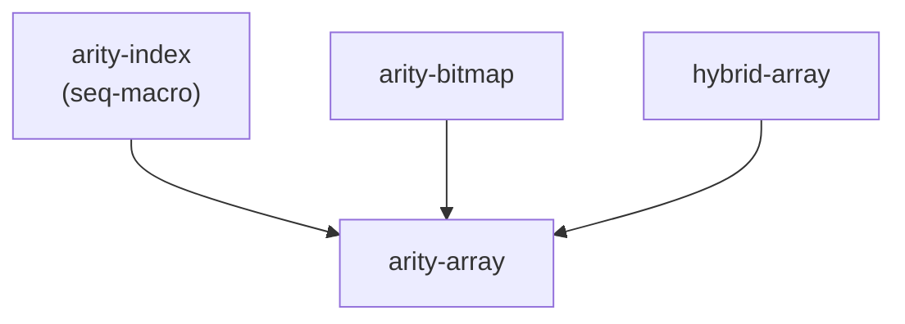

# Arity Arrays — Design

> Status: proposed · 2026-06-26
>
> Three small, `no_std` crates for fixed-arity array storage indexed by
> bounds-check-free niche integers, with a compact heap-packed sparse
> representation. Generalizes the `DenseChildren` / `Children` / `U4` work from
> [`ava-labs/firewood#2100`](https://github.com/ava-labs/firewood/pull/2100) from
> a single 16-wide trie-children layout to arbitrary power-of-two arities from 8
> to 256.
>
> **Supersedes the initial scaffold.** The repository starts with a single
> `arity-arrays` crate whose modules are `bitmap` / `dense` / `sparse`, plus an
> `xtask` whose only command (`generate-niche-repr`) emits niche `Repr` enums as
> text. This design replaces that scaffold: three crates (below), modules named
> `fixed` / `packed`, and compile-time `seq-macro` codegen in place of the xtask
> command. The empty scaffold files are restructured before any code is written;
> the `xtask` `generate-niche-repr` command is removed (see [Codegen](#the-niche-trick)).

## Motivation

A 16-ary hexary trie stores each branch node's children in a fixed array indexed
by a 4-bit nibble. Two representations are useful:

- A **full-width** array — one slot per index, every slot materialized. Cheap
  random access, fixed size regardless of occupancy.
- A **packed** array — only present entries stored, addressed by a bitmap.
  Pointer-sized when empty; heap cost proportional to occupancy. This is the
  memory-amplification defense from firewood#2100: a 16-slot
  `Children<Option<HashType>>` costs ~528 bytes even when empty, while the packed
  form costs one pointer plus `bitmap + occupancy × size_of::<T>()`.

Both rely on a **niche integer index** — a 4-bit type whose value is statically
known to be in `0..16`, which (a) makes `Option<Index>` one byte via niche
optimization and (b) lets the compiler elide bounds checks when indexing.

This project generalizes all three pieces — the index, the bitmap, and the two
arrays — over a power-of-two **arity** `N ∈ {8, 16, 32, 64, 128, 256}`, each with
a matching niche index type and bitmap backing:

| Arity `N` | Index type | `Option<Index>` | Bitmap backing |
| --------: | ---------- | --------------- | -------------- |
|         8 | `U3`       | 1 byte          | `u8`           |
|        16 | `U4`       | 1 byte          | `u16`          |
|        32 | `U5`       | 1 byte          | `u32`          |
|        64 | `U6`       | 1 byte          | `u64`          |
|       128 | `U7`       | 1 byte          | `u128`         |
|       256 | `u8`       | 2 bytes¹        | `U256`         |

¹ Arity-256 uses the native `u8` as its index. `u8`'s maximum (255) is already
`< 256`, so indexing a 256-element array elides the bounds check without a custom
type; `Option<u8>` is 2 bytes, but no `Option<index>` is stored on a hot path, so
this costs nothing in practice.

## Goals & non-goals

**Goals**

- Three focused, `no_std` crates with a clean dependency DAG.
- One niche index type per arity, with `Option<U{n}>` provably one byte and
  bounds-check elision on indexing.
- `FixedArray<T, A>` (full-width) and `PackedArray<T, A>` (heap-packed), both
  generic over a single `Arity` trait.
- `PackedArray` is **pointer-sized** for every arity and zero-heap when empty.
- A strict `unsafe` quality bar: every `unsafe` block documented, Miri-clean,
  property-tested.

**Non-goals (deferred — see [Future work](#future-work))**

- In-place mutation of `PackedArray` (`insert`/`remove`). It is
  immutable-after-construction; mutate by round-tripping through `FixedArray`.
  **Known cost:** the round trip materializes a full `FixedArray<Option<T>, A>` —
  `O(A::LEN × size_of::<Option<T>>())` of stack, independent of occupancy. At
  arity 256 with a 32-byte `T` that is a ~8 KiB stack temporary; for very large
  `T` or constrained stacks this can be significant. This is acceptable for the
  motivating use case (trie branch writes are infrequent and `T` is pointer- or
  hash-sized), but it is the reason a future in-place API is worth having.
- A general-purpose big-integer `U256` (arithmetic, formatting). Only the bitmap
  operations the arrays need are implemented.
- Serialization / wire formats. Out of scope for these crates.
- Non-power-of-two or runtime arities.

## Workspace layout

```
crates/
  arity-index/         # no_std, no alloc — integer index primitives
    src/lib.rs
    src/niche.rs       # `Niche` trait + macro generating U3..U7; `u8` impl
  arity-bitmap/        # no_std, no alloc — bitmap primitives
    src/lib.rs         # `Bitmap` trait + impls for u8/u16/u32/u64/u128
    src/u256.rs        # `U256([u128; 2])` bitmap backing (safe code)
  arity-array/         # no_std + alloc — the arrays
    src/lib.rs
    src/arity.rs       # `Arity` trait + markers Arity8..Arity256
    src/fixed.rs       # FixedArray<T, A>
    src/packed.rs      # PackedArray<T, A>
```

### Dependency DAG



`arity-index` and `arity-bitmap` are independent leaves — neither depends on the
other. `arity-array` is the only crate that needs `alloc`, and the only one with
heavy `unsafe`. Splitting this way keeps the primitive types reusable and lets
their tests run without touching the allocator.

## `arity-index`

### The niche trick

A niche index type is a newtype over a **fieldless enum with exactly `2ⁿ`
variants** — firewood's `U4`/`Repr` pattern, generalized:

```rust
// generated for n = 4 (illustrative)
#[derive(Clone, Copy, PartialEq, Eq, PartialOrd, Ord, Hash)]
enum Repr4 { V0, V1, /* … */ V15 }

#[derive(Clone, Copy, PartialEq, Eq, PartialOrd, Ord, Hash)]
pub struct U4(Repr4);
```

The enum gives the compiler a layout with `2ⁿ` valid discriminants and the rest
as **niches**, which earns both payoffs:

- `Option<U{n}>` reuses an unused discriminant for `None` → stays 1 byte.
- A value of type `U{n}` is statically known to be in `0..2ⁿ`, so indexing a
  `2ⁿ`-length array can elide the bounds check.

`U7` needs 128 variants — too many to hand-write — so the macro uses
[`seq-macro`](https://docs.rs/seq-macro) (stable) to generate `V0..V{2ⁿ-1}` and
the `0..2ⁿ` match arms. The single declarative macro is invoked five times
(`niche_int!(U3, Repr3, 3); … niche_int!(U7, Repr7, 7);`).

This replaces the scaffold's `xtask generate-niche-repr` text-codegen command,
which is removed. Compile-time expansion keeps a single source of truth (no
committed generated `.rs` to drift), at the cost of one build dependency
(`seq-macro`) and generated code that is visible only via `cargo expand`. Both the inner `Repr`
enum and the outer `U{n}` struct derive `Default` (`#[default]` on variant 0, so
`U{n}::default() == U{n}::MIN`), following the scaffold's existing convention. With `generate-niche-repr` gone, the `xtask` crate has no remaining
commands and is removed from the workspace; if it is later reinstated for other
dev tasks it must set its own `rust-version = "1.96"` (CLI MSRV, per repo rules).

### Generated surface (per `U{n}`)

```rust
impl U{n} {
    pub const BITS: u32 = n;
    pub const COUNT: usize = 1 << n;       // number of valid values
    pub const MIN: Self;                    // 0
    pub const MAX: Self;                    // COUNT - 1
    pub const ALL: [Self; Self::COUNT];     // every value, ascending

    pub const fn try_new(v: u8) -> Option<Self>;
    pub const unsafe fn new_unchecked(v: u8) -> Self;  // SAFETY: v < COUNT
    pub const fn new_masked(v: u8) -> Self;            // keeps low n bits
    pub const fn as_u8(self) -> u8;
    pub const fn as_usize(self) -> usize;
}
// derives: Clone, Copy, PartialEq, Eq, PartialOrd, Ord, Hash, Default (== MIN)
// impls:   Debug, Display, LowerHex, UpperHex, Binary, TryFrom<u8>
```

`new_unchecked` is the sole `unsafe` entry point; `new_masked` calls it after
masking, so it is always sound. `ALL` is the analogue of firewood's
`PathComponent::ALL` and is the canonical iteration order.

### The `Niche` trait

A **sealed** trait unifies the index types so `arity-array` can be generic:

```rust
pub trait Niche: Copy + Ord + sealed::Sealed {
    const COUNT: usize;                       // 2^BITS (8,16,32,64,128,256)
    const ALL: &'static [Self];               // length == COUNT, ascending
    fn as_usize(self) -> usize;               // always < COUNT
    fn try_from_usize(i: usize) -> Option<Self>;
}
```

The trait deliberately has **no `new_unchecked`**. The one internal place that
reconstructs an index from a known-valid value (a bitmap `trailing_zeros()`
result) calls `Self::try_from_usize(i).unwrap_unchecked()` with a `// SAFETY:`
note, keeping the only `unsafe` constructor (`new_unchecked`) an *inherent*
method on the concrete types rather than trait surface every future implementor
must uphold. This also sidesteps a parameter-type mismatch: the inherent
`U{n}::new_unchecked` takes `u8` (matching firewood), while the trait works in
`usize`.

`ALL` is a `&'static [Self]`; each impl supplies it as `&Self::ALL_ARRAY` (a
reference to the inherent `const ALL: [Self; COUNT]`, promoted to `'static` and
coerced array→slice — valid in `const` on stable).

Implemented for `U3..U7` (generated) and for **`u8`** (`COUNT = 256`, `ALL` is
the 256-byte ascending table, `try_from_usize` is `(i < 256).then(|| i as u8)`).
`u8` is the arity-256 index.

`arity-index` is `#![no_std]` and does **not** use `alloc`.

## `arity-bitmap`

### The `Bitmap` trait

A **sealed** trait over the bitmap backings, exposing only what the arrays need —
no arithmetic:

```rust
pub trait Bitmap: Copy + Eq + sealed::Sealed {
    const WIDTH: usize;                       // bit count: 8,16,32,64,128,256
    const ZERO: Self;
    fn is_zero(self) -> bool;
    fn count_ones(self) -> u32;               // number of present slots
    fn trailing_zeros(self) -> u32;           // index of lowest set bit
    fn test(self, i: usize) -> bool;          // is bit i set?       (i < WIDTH)
    fn with_bit(self, i: usize) -> Self;      // set bit i           (i < WIDTH)
    fn rank(self, i: usize) -> u32;           // # set bits below i  (i < WIDTH)
    fn clear_lowest(self) -> Self;            // clears lowest set bit
}
```

> [!IMPORTANT]
> `test`, `with_bit`, and `rank` share the **precondition** `i < Self::WIDTH`.
> These index methods compute `1 << i` (`rank` uses the mask `(1 << i) - 1`); a
> shift `>= WIDTH` is UB in release and panics in debug (e.g. `1u8 << 8`). `rank`
> never needs `i == WIDTH`: the total population is `count_ones()`, and every
> caller passes a valid slot index `< WIDTH`. Callers are
> internal to `arity-array` and always pass `A::Index::as_usize()`, which is
> `< A::LEN == WIDTH` by construction, so the precondition holds by typing; the
> trait is sealed, so no external caller can violate it. The precondition is
> documented on each method rather than enforced with `unsafe`, since violating
> it is a logic bug (debug panic), not memory unsafety.

`rank(i)` is the dense offset of slot `i` within a `PackedArray` allocation.
Iteration over present slots in ascending order is `trailing_zeros` +
`clear_lowest` until `is_zero`. `with_bit` builds a bitmap when converting a
`FixedArray` into a `PackedArray`.

Implemented for `u8, u16, u32, u64, u128` (thin wrappers over the standard
methods) and for `U256`.

### `U256`

```rust
pub struct U256 { lo: u128, hi: u128 }   // bit i: i<128 → lo bit i, else hi bit i-128
```

Pure **safe** code. Bit `i` lives in `lo` for `i < 128` and `hi` otherwise;
`count_ones`/`trailing_zeros`/`rank` combine the two limbs (e.g.
`trailing_zeros = if lo != 0 { lo.trailing_zeros() } else { 128 + hi.trailing_zeros() }`).
`clear_lowest` clears the lowest limb's lowest bit. Only the `Bitmap` surface is
implemented — no `Add`/`Mul`/`From`/`Display`.

`arity-bitmap` is `#![no_std]` and does **not** use `alloc`. It does not depend
on `arity-index`.

## `arity-array`

### The `Arity` trait

The single "trait interface" both arrays are generic over. Sealed; one marker
type per arity:

```rust
pub trait Arity: sealed::Sealed {
    const LEN: usize;                          // 8,16,32,64,128,256
    type Index: Niche;                         // U3..U7 or u8
    type Bitmap: Bitmap;                       // u8..u128 or U256
    type Size: hybrid_array::ArraySize;        // typenum U8..U256, backs FixedArray
}

pub enum Arity8 {} pub enum Arity16 {} /* … */ pub enum Arity256 {}
```

Each marker wires index ↔ bitmap ↔ size together (e.g. `Arity16`: `LEN = 16`,
`Index = U4`, `Bitmap = u16`, `Size = typenum::U16`). Invariants the wiring
guarantees and tests assert:
`Index::COUNT == LEN == Bitmap::WIDTH == Size::USIZE`.

> [!NOTE]
> **`typenum` is an acknowledged sunset dependency.** `type Size: ArraySize`
> exists only because stable Rust cannot write `[T; A::LEN]` with `LEN` a trait
> associated `const` (`generic_const_exprs` is unstable). `hybrid-array` /
> `typenum` is the right tool today, but `Arity::Size` and `ArraySize` leak into
> downstream `where` bounds. To contain the blast radius, **`hybrid_array::Array`
> never appears in a public function signature** — `FixedArray` exposes
> `Deref<Target = [T]>` / `AsRef<[T]>` instead. When `generic_const_exprs`
> stabilizes, the internal storage can switch to `[T; A::LEN]`; keeping `Array`
> out of the public surface is what makes that a non-breaking change.

### `FixedArray<T, A: Arity>`

Full-width inline storage — one `T` per slot — over `hybrid_array::Array<T, A::Size>`:

```rust
pub struct FixedArray<T, A: Arity>(hybrid_array::Array<T, A::Size>);
```

Indexed by `A::Index`. `get`/`get_mut` use `slice::get_unchecked(index.as_usize())`:

```rust
// SAFETY: `A::Index::as_usize()` is always < Index::COUNT == A::LEN, which equals
// the array length, so the index is in bounds.
unsafe { self.0.get_unchecked(index.as_usize()) }
```

This is the documented "no bounds check" path. Ported surface (from firewood's
`Children`): `from_fn`, `each_ref`/`each_mut`, `get`/`get_mut`/`replace`, `map`,
`merge`, `Index`/`IndexMut`, and `IntoIterator` (zipping `A::Index::ALL` with the
elements). The `FixedArray<Option<T>, A>` specialization adds `new`, `count`,
`take`, `iter_present`, and `take_only_child`.

### `PackedArray<T, A: Arity>`

The pointer-sized heap-packed representation — firewood's `DenseChildren`,
generalized over `A`:

```rust
pub struct PackedArray<T, A: Arity>(Option<NonNull<Inner<A, T>>>, PhantomData<Box<T>>);

#[repr(C)]
struct Inner<A: Arity, T> {
    bitmap: A::Bitmap,
    data: [T; 0],   // address anchor; element base via &raw mut (*p).data (RFC 2582)
}
```

Layout & invariants:

- `None` ↔ empty, **zero heap**. The `NonNull` null-pointer niche makes
  `PackedArray<T, A>` **pointer-sized** for every `A`.
- `Some(p)` ↔ a heap block: `Inner` header + `bitmap.count_ones()` elements,
  stored in ascending slot order. **Invariant: when allocated, `bitmap != 0`.**
  This is documented rather than encoded with `NonZero`. firewood's
  `DenseChildren` used `NonZeroU16` for a *static* non-zero guarantee; that
  guarantee is given up here **for every arity** (8–128 have `NonZeroU8..U128`
  counterparts, but `U256` does not) to keep `A::Bitmap` and the `Inner` layout
  uniform across all arities. The pointer-niche that makes the type pointer-sized
  is on the outer `NonNull`, not the bitmap, so nothing about the size guarantee
  depends on the bitmap being `NonZero`.
- The allocation layout is `Layout::new::<Inner>().extend(Layout::array::<T>(count))`
  padded to alignment — identical to firewood's `alloc_layout`.

Behavior (ported and generalized):

- `new`/`Default` (empty), `bitmap`, `count`, `get` (via `Bitmap::rank`),
  `iter_present` (`(A::Index, &T)`), all-slots `iter` (`(A::Index, Option<&T>)`).
  Both iterators are `ExactSizeIterator + FusedIterator`. The all-slots iterator's
  slot counter is **`usize`**, not `u8` (firewood used `u8` for its fixed 0..16;
  a `u8` counter wraps before reaching slot 255 at arity 256).
- `Drop`: read count from the bitmap, then one `ptr::drop_in_place` over a slice
  pointer covering all elements, then `dealloc`.
- `Clone`: allocate, copy the bitmap, clone elements under a `CloneGuard` drop
  guard that frees partially-cloned elements (and the allocation) if `T::clone`
  panics.
- `PartialEq`/`Eq`/`Hash` (bitmap then element slice), `Debug` (map of present
  slots), `Send`/`Sync`/`UnwindSafe`/`RefUnwindSafe` under the matching `T` bounds.
- Conversions, symmetric with `FixedArray`:
  - `From<FixedArray<Option<T>, A>>` — two-pass: compute bitmap by ref, then move
    each `Some` into the allocation.
  - `From<&FixedArray<Option<T>, A>>` (`T: Clone`) — clone present into a scratch
    buffer, then into the allocation.
  - `From<PackedArray<T, A>> for FixedArray<Option<T>, A>` — `ManuallyDrop` +
    `ptr::read` to move out without `T: Clone`.
  - `From<&PackedArray<T, A>> for FixedArray<Option<T>, A>` (`T: Clone`).

`arity-array` is `#![no_std]` with `extern crate alloc;` (`alloc`/`dealloc`,
`NonNull`, `ptr`, `slice` from `core`/`alloc`).

## `unsafe` quality bar

The `unsafe` is concentrated in `arity-array::packed` (raw allocation, pointer
arithmetic, manual drop) and the `new_unchecked` constructors in `arity-index`.
`arity-bitmap` (including `U256`) is entirely safe code.

- **Every `unsafe` block** carries a `// SAFETY:` comment naming the invariant it
  relies on. This requires two **workspace `Cargo.toml` lint changes**: promote
  `clippy::undocumented_unsafe_blocks` from its current `"warn"` to **`"deny"`**,
  and add `unsafe_op_in_unsafe_fn = "deny"` under `[workspace.lints.rust]` (absent
  today). Without these the toolchain cannot enforce the bar described here.
- **Miri**: the full `arity-array` test suite runs under `cargo +nightly miri
  test` (catches provenance, alignment, leak, and use-after-free errors in the
  allocation/drop/clone/conversion paths).
- **No `#[allow]`** (per repo rules); `#[expect(reason = …)]` only where
  unavoidable (e.g. `clippy::indexing_slicing` on a statically-bounded `ALL`
  lookup).

## Testing strategy

- **Per-arity coverage** across all six widths — not just the 16-wide case —
  driven by a generic test helper parameterized over `A: Arity`:
  - empty, single-child (the rank-zero boundary, exercised at every slot),
    sparse, and full occupancy;
  - `get` hits/misses, `iter_present` ascending order, all-slots iterator length
    `== LEN`.
- **Ported firewood tests**: pointer-size assertion, `Default` empty,
  drop-count-exactly-once, clone equality + independence (drop counts on both
  copies), **clone-panic drop-guard** (partial clones freed on unwind), and
  owned/by-ref round-trips through `FixedArray`.
- **Niche assertions**: `size_of::<Option<U{n}>>() == 1` for `n ∈ 3..=7`;
  `size_of::<PackedArray<T, A>>() == size_of::<*const ()>()` for every `A`;
  `U{n}::ALL` is ascending and length `COUNT`.
- **`arity-bitmap` property tests** (`proptest`): for each backing including
  `U256`, cross-check `count_ones`, `trailing_zeros`, `test`, `rank`, `with_bit`,
  and `clear_lowest` against a reference bit-set model.
- **Round-trip property tests**: arbitrary occupancy → `PackedArray` → back is
  the identity; element order preserved.

## Dependencies & toolchain

- `arity-index`: `seq-macro` (latest, via `cargo add`).
- `arity-bitmap`: none (dev: `proptest`).
- `arity-array`: `hybrid-array` (already present), `arity-index`, `arity-bitmap`
  (dev: `proptest`).
- Edition 2024 (workspace default). Bump workspace `rust-version` **1.85 → 1.92**
  (`&raw` needs 1.82, edition 2024 needs 1.85; 1.92 is the library MSRV target and
  comfortably covers both).

## Future work

- **In-place `PackedArray` mutation** (`insert`/`remove`): realloc + element
  shift under the existing drop-safety discipline. Addable **without breaking the
  public API**, which is why it is deferred now.
- Additional `Bitmap`-derived conveniences (e.g. `FromIterator`, set algebra) if
  a consumer needs them.
- `U256` could grow into a fuller integer type if a use case appears; today the
  `Bitmap` surface is all that is needed.
